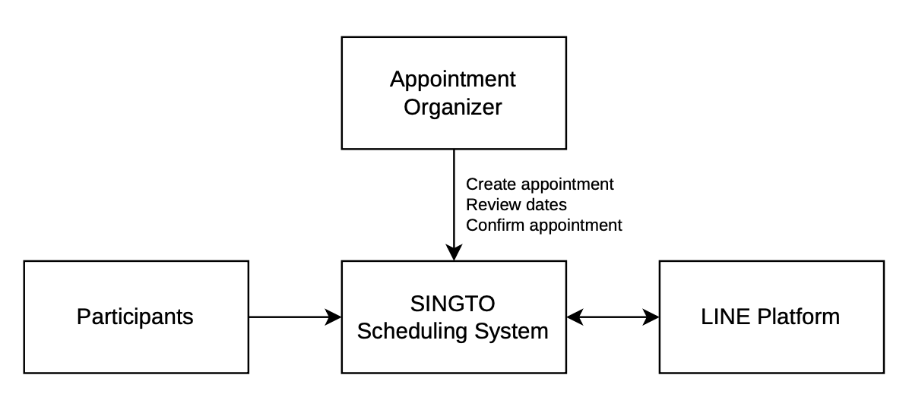

# System Diagrams — Singto

This document presents the main system diagrams for the Singto scheduling assistant, including the system context, use cases, system architecture, and core scheduling workflow.

---

# D1. Context Diagram

The Context Diagram shows Singto as the central system and its interactions with external actors and services.

   

### Main External Entities

| Entity | Interaction with Singto |
|---|---|
| **Organizer** | Creates appointments, reviews suggested dates, and confirms the final appointment |
| **Participants** | Access scheduling sessions and submit their availability |
| **LINE Platform** | Provides the communication channel for interacting with Singto and sharing scheduling links |

---

# D2. Use Case Diagram

The Use Case Diagram describes the main interactions between users and the Singto system.

(รูป)

### Main Use Cases

1. **Create Appointment** — Organizer creates a new scheduling session.
2. **Set Scheduling Period** — Organizer defines the dates or period for scheduling.
3. **Share Scheduling Link** — Organizer shares the scheduling session with participants.
4. **Submit Availability** — Participants provide their available dates.
5. **View Availability Summary** — Users review collected availability information.
6. **Analyze Availability** — Singto compares participants' availability.
7. **Suggest Best Date** — Singto identifies and presents suitable dates.
8. **Confirm Appointment** — Organizer selects and confirms the final appointment.
9. **Receive Notifications** — Participants receive relevant scheduling reminders or updates.

---

# D3. System Architecture Diagram

The Architecture Diagram shows the major components of Singto and how they communicate.

(รูป)

### Architecture Components

| Component | Responsibility |
|---|---|
| **LINE Platform** | Provides the group communication channel and integration interface |
| **Web Application** | Provides the user interface for creating appointments, submitting availability, and viewing results |
| **Backend API** | Handles application logic, requests, appointment management, and communication between system components |
| **Scheduling Engine** | Compares participants' availability and identifies suitable date |
| **Notification Service** | Handles scheduling-related reminders and updates |
| **Database** | Stores appointments, participants, availability, and confirmed appointment information |

---

# D4. Activity Diagram — Core Scheduling Workflow

The Activity Diagram describes the main workflow from creating an appointment to confirming the final date.

(รูป)

### Core Workflow

The main Singto workflow is:

**Call Singto → Create an Appointment → Share Availability → Find the Best Date → Confirm the Appointment**

The system collects availability from participants, analyzes the information, and suggests suitable dates. The organizer remains responsible for making the final appointment decision.

---

# Diagram Relationships

| Diagram | Focus | Main Question |
|---|---|---|
| **D1 Context** | System boundary | Who/what interacts with Singto? |
| **D2 Use Case** | User interactions | What can each actor do? |
| **D3 Architecture** | System structure | How are the technical components connected? |
| **D4 Activity** | Process flow | How does the scheduling process work step by step? |

Together, these diagrams provide a consistent view of Singto from the external system context to the internal architecture and core user workflow.